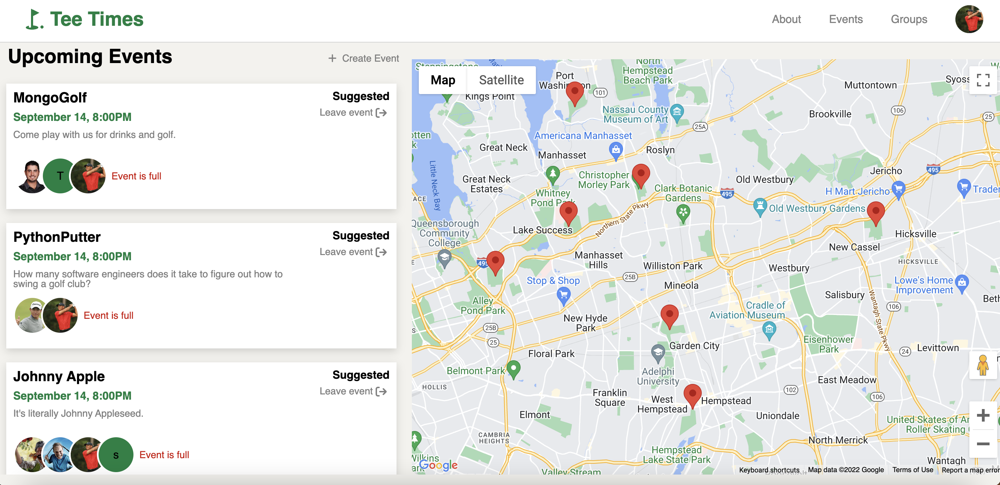
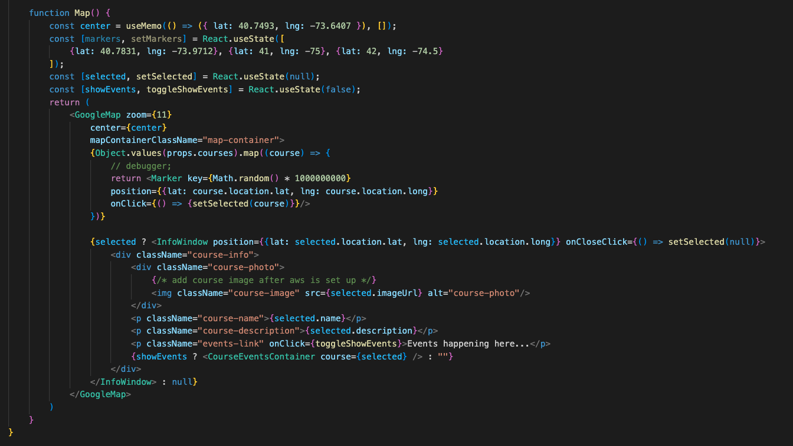
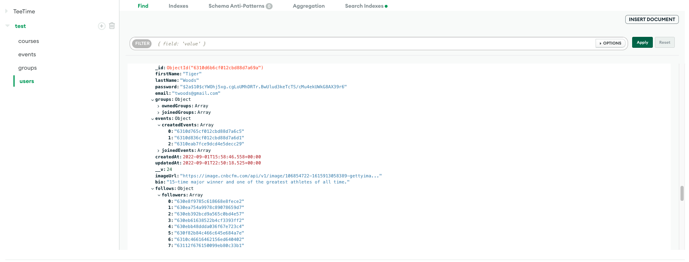

# Tee-Time

Live link: https://tee-time-application.herokuapp.com/#/

## Background and Overview 
One of the biggest barriers to entry for people looking to pick up the game of golf is finding people to play with.

Tee-Time is a platform for finding and building local groups to get together for a round. This full stack web application will also let users easily keep track of their upcoming tee times and groups they are a part of.

Our application will consist of:
* A user dashboard, with a list upcoming events and users/courses they have played
* A feed page to display open events and public groups for users to join
* Google Maps API to see events near you on the map

## Functionality & MVP 
* User authorization: signup and login 
* Users will be able to view nearby courses 
* Users will be able to create and join groups 
* Users will be able to create and join events 
* Users will be able to connect with other users
* Production README 

### Overview

Tee-Time is a full stack web application where users can connect with other users to find local games happening around their area. It is written in JavaScript and based on Node and Express using MongoDB to store data. 

Users can find local groups, join events and track which courses they've played on and who they've played with. The app boasts full CRUD functionality across all these features along with a sleek and easy user experience.

## Technologies Used
* Google Maps API 
* AWS 
* MongoDB
* Express 
* React/Redux 
* Nodejs

### MERN Stack

The web app utilizes MongoDB, Express.js, React.js and Node.js. User's info as well as image data is stored using a non-relational database with documents while React renders everything to the screen through a single page model.

## Implementation Details

### Google Maps API

Once a client logs in, they will immediately be directed to their events dashboard. This displays events in the area that they can join along with markers on an interactive map to show their location. Upon hover on these markers, information about the course is displayed.

### MongoDB/Mongoose

The backend architecture leverages MongoDB's NoSQL database structure to store documents for users, groups, events, and courses, include referential data across these documents as needed.

## Future additions

* Chat functionality within events, deployed with Websocket